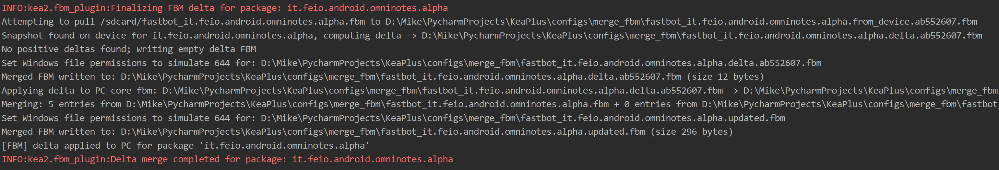

# FBM Merge（实验性功能）

## 功能简介
FBM Merge（模型合并）功能支持分布式测试环境（多机并行测试），每轮结束时通过聚合 Fastbot 模型，实现训练加速和模型共享。

## 启用方式
只需在运行 kea2 时添加 `--merge-fbm` 参数：
```bash
kea2 run -s "emulator-5554" -p it.feio.android.omninotes.alpha --running-minutes 10 --merge-fbm propertytest discover -p quicktest.py
```

## 设计目的
- 适用于多机分布式运行 kea2（一个 PC 对多个手机设备）。
- 通过合并多机运行的 fbm 数据，弥补单机 activity 覆盖率不足。
- 合并后的 fbm 文件自动维护在 PC 端，便于后续复用。
- 合并过程自动对 fbm 文件进行“瘦身”，大幅减小文件体积，提升性能。

## 实现原理
1. **自动拉取与合并**：
   - kea2 运行开始时，从移动设备复制一份 fbm 文件，作为本轮“起始点”。
   - 运行结束后，将本轮产生的 fbm 文件和起始点文件拉回 PC。
   - PC 端计算两者的增量，得到本次新生成的 fbm 数据，并合并到 PC 上的核心 fbm 文件。
   - 合并过程加锁，防止并发读写冲突。
2. **文件权限**：
   - Linux/MacOS 下合并文件权限为 644。
   - Windows 下为 Administrators 完全控制、Everyone 只读，并关闭权限继承（模拟 644 权限）。
3. **文件瘦身**：
   - 数据结构和索引两方面去重，合并重复数据条目，共同完成文件瘦身。
     - **数据结构去重**：对于同一个 action，无论在不同设备或多次测试中出现多少次，只保留一份 action 记录，并将其下面相同的activity 触发次数累加，避免数据条目重复而占用空间。
     - **索引去重**：在保存fbm文件时进行了索引上的去重，比如同样的`MainActivity`这个字符串只创建一次索引，从而减小了fbm文件占用的空间。
   - 平均可减小 90% 体积。例如，6MB 的 fbm 文件瘦身后仅 226KB，数据条目数从 87933 降至 6025。
   - 示例：原有“MainActivity 15”和“MainActivity 10”两条数据，合并为“MainActivity 25”。

## 使用说明
- 用户只需在运行 kea2 run的时候添加 `--merge-fbm` 参数，PC 端 fbm 文件会自动维护。
- **注意**：PC 端 fbm 文件不会自动 push 到手机。若需在设备端生效，需手动 push 到手机 `/sdcard` 目录。
- 合并后的 fbm 文件位于 `configs/merge_fbm/` 目录。

### push 到设备示例
```bash
adb -s <devicename> push $root_dir/configs/merge_fbm/fastbot_<package_name>.fbm /sdcard
```

## 典型应用场景
1. **新设备首次测试**：push 合并后的 fbm 文件，获得老设备的模型加持。
2. **大批量设备测试**：每次测试后推送 PC 端合并文件，提升各设备间的覆盖度一致性。

## 控制台输出示例

下图展示了 FBM Merge 成功后的 console 打印示例：


